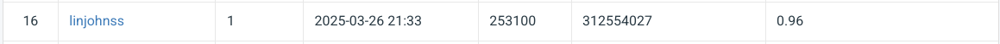

# NYCU Computer Vision 2025 Spring HW1

**StudentID:** 312554027  
**Name:** 林晉暘

---

## 📌 Introduction

This project implements a deep learning-based image classification model using a ResNeXt backbone. To enhance the performance, attention modules such as CBAM (Convolutional Block Attention Module) are integrated. Data augmentation techniques like AugMix, CutMix, and MixUp are applied to improve generalization and robustness.

---

## 🛠️ How to install

1. Create and activate a virtual environment:
   ```bash
    conda create -n cv_hw1 python=3.9
    conda activate cv_hw1
   ```

2. Install dependencies:
   ```bash
   pip3 install torch torchvision torchaudio --index-url https://download.pytorch.org/whl/cu118
   pip install -r requirements.txt
   ```

---

## 🚀 How to train

You can train the model by running:

```bash
python main.py --train \
  --train_data_dir /path/to/train \
  --valid_data_dir /path/to/val \
  --output_dir ./outputs \
  --model MODEL_TYPE
```

Available `--model` options:
- `resnext50` – ResNeXt-50 baseline
- `resnext101` – ResNeXt-101 baseline
- `resnext101_cbam` – ResNeXt-101 with full CBAM
- `resnext101_cbam_layer` – ResNeXt-101 with CBAM applied to last few layers

Training-related options (can be configured via argparse):
- `--epochs`: number of training epochs (default: 50)
- `--lr`: learning rate (default: 1e-3)
- `--batch_size`: batch size (default: 64)

Example:

```bash
python main.py --train \
  --train_data_dir ./data/train \
  --valid_data_dir ./data/val \
  --output_dir ./outputs \
  --model resnext101_cbam \
  --epochs 50 --lr 1e-3 --batch_size 64
```

---

## 🧪 Evaluation

After training, you can evaluate the best model and generate validation confusion matrix:

```bash
python main.py --eval --output_dir ./outputs
```

Outputs:
- ✅ `val_confusion_matrix_top10.png`: validation confusion matrix (top 10 frequent classes)
- ✅ `prediction.csv`: test predictions

---

## 📊 Performance snapshot



